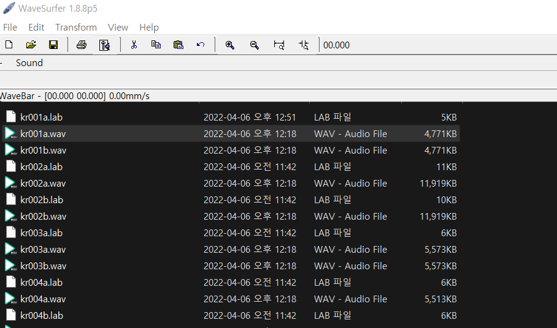

## How to phoneme alignment

> Note : Fitting a phoneme to an actual pronunciation column is called forced phoneme alignment.

### Tool

-   [WaveSurfer](https://sourceforge.net/projects/wavesurfer) => WaveSurfer is an open source tool for sound visualization and manipulation.

    > The default voice forced alignment tool used by this repository.

    > This [configuration file](https://github.com/DynamiVox/dyv-wavesurfer-transcription) is convenient.

-   [Praat](https://www.fon.hum.uva.nl/praat) => A tool used for vocalization, speech, and language analysis.

    > It's a powerful tool that includes scripts, various graphs, and more, but it can be uncomfortable for phoneme alignment.

### 🚩Roadmap

1. Prepare the WaveSurfer.

    > Please refer to the "Tool" column above and download the executable and configuration files to the appropriate location.

2. Load the file into WaveSurfer.

    > After loading using drag-end drop, click the configuration file to load it.

    > ⚠️ Do not check the Set to Default Configuration option. ⚠️

    > 

3. Proceed with the phoneme alignment operation.

    1. To create and delete labels in the .lab area

    https://user-images.githubusercontent.com/25889754/162585170-715dee2e-17c0-48a7-90f2-c5f1e1ac642e.mp4

    2. You can move the label.

    https://user-images.githubusercontent.com/25889754/162585179-c21d3061-754d-4768-9c5c-557d43f5075f.mp4

4. 🎉 Finish

    > You can use the completed .lab file.
